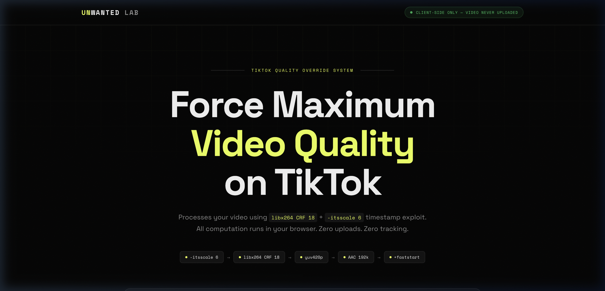

# UNWANTED LAB (TikTok Video Processor)



UNWANTED LAB is an advanced video processing tool designed to optimize videos for TikTok by bypassing its aggressive 120fps ingest compression.

## How it Works & Features

This application uses a combination of high-quality re-encoding and metadata engineering tricks to ensure TikTok allocates the highest possible bitrate to your video.

1. **Prepare your Video**: Edit your video as usual (60fps is highly recommended).
2. **Select a Mode**:
   - **HQ_REENCODE**: Performs a pure re-encode using `libx264` (CRF 18) to heavily compress the file size without sacrificing any visual quality, preparing it perfectly for upload.
   - **FAST_TRICK**: Instantly injects a specialized metadata trick into your video without re-encoding. This tricks the TikTok Ingest system into treating the video as a 120fps file.
   - **COMBO_MAX**: Runs the `HQ_REENCODE` first for maximum quality compression, and then automatically injects the `FAST_TRICK` on the output. *(Highly Recommended)*
3. **Execute**: Simply drag & drop your video into the application window. The app will process it automatically and display a real-time progress terminal.

## What Happens After Processing?

Once the process reaches 100% and displays **✓ Selesai** (or **✓ COMBO Selesai!**), a new video file will be generated.
1. The file will automatically be saved in the **exact same folder** as your original video.
2. The output file will have a `_shifted.mp4` suffix added to it (e.g., `original_video.mp4` becomes `original_video_shifted.mp4`).
3. **IMPORTANT NOTE**: If you play this `_shifted.mp4` file directly on your computer or phone using a standard media player, the video may appear stuttery, in slow-motion, or have an artificially extended duration. **This is completely normal and intentional** as the high-framerate metadata trick is actively applied.

## How to Upload to TikTok

To achieve a perfectly smooth and crystal-clear 60fps result on TikTok:
1. **MANDATORY**: You must use a **PC/Laptop Desktop Browser** (Google Chrome, Safari, or Edge). Do NOT use the TikTok mobile app (Android/iPhone) to upload this processed file.
2. Go to [tiktok.com](https://www.tiktok.com/) on your PC browser and log into your account.
3. Click the **Upload** button in the top right corner.
4. Upload the `_shifted.mp4` file generated by the UNWANTED LAB app.
5. Wait for the upload to complete and publish the video. Once published, TikTok's server system will reprocess the "slow-motion" file, and it will **automatically return to normal speed** with crystal-clear 60fps quality, perfectly viewable on both mobile devices and PCs.

---

## How to Compile / Build from Source

If you want to compile and build this application yourself from the source code, please follow the steps below.

### Requirements
- You must have **Node.js** installed on your computer. [Download Node.js here](https://nodejs.org/).

### Build Steps
1. **Clone this Repository:**
   ```bash
   git clone https://github.com/bagusmibr/unwantedlab.git
   cd unwantedlab
   ```

2. **Install Dependencies:**
   Run this command to download all required modules (such as Electron and FFmpeg):
   ```bash
   npm install
   ```

3. **Run the App (Development Mode):**
   To test the application without compiling it:
   ```bash
   npm start
   ```

4. **Compile the Application (Release Build):**
   Run one of the following commands depending on your target operating system:

   - To build the **Windows App (`.exe`)**:
     ```bash
     npm run build:win
     ```
     *(The output will be inside the `dist/` folder as a portable executable or unpacked folder)*

   - To build the **macOS App (`.app`)**:
     ```bash
     npm run build:mac
     ```
     *(The output will be inside the `dist/` folder)*

---
*Created by Bagus (Shifted) · MIBR*
